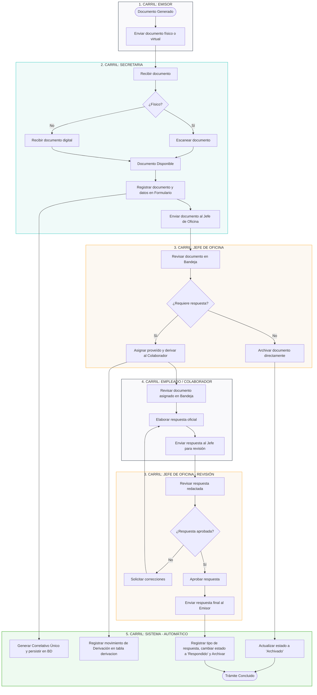
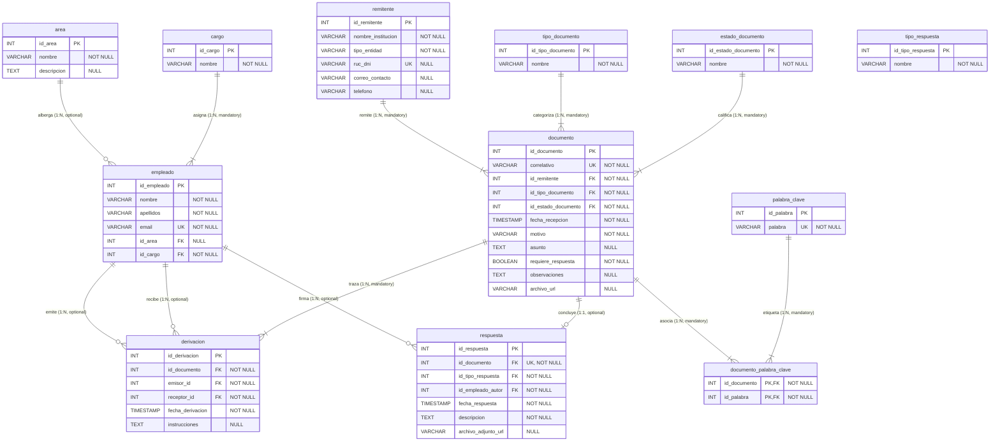
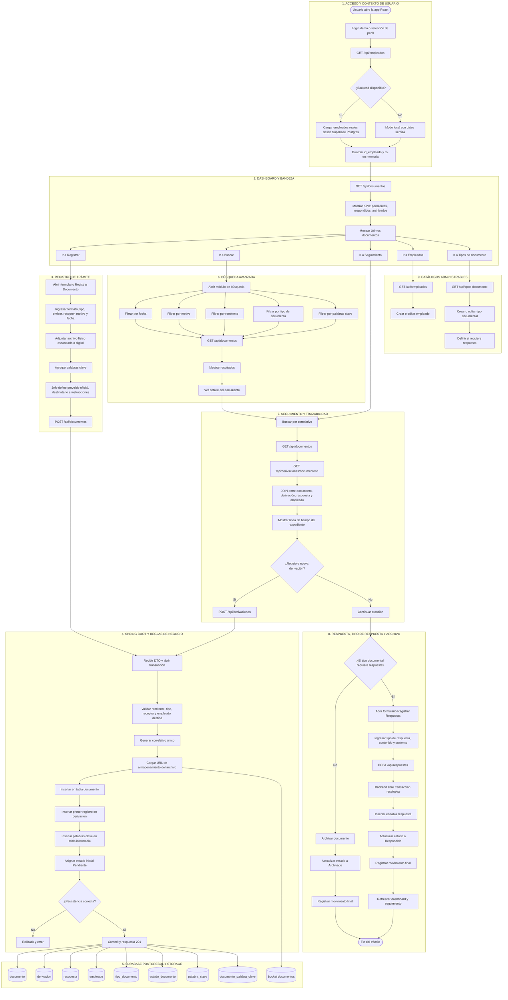

# UNIVERSIDAD NACIONAL AGRARIA LA MOLINA

## FACULTAD DE ECONOMÍA Y PLANIFICACIÓN

### DEPARTAMENTO ACADÉMICO DE ESTADÍSTICA E INFORMÁTICA

---

**CURSO:** Sistemas de Gestión de Base de Datos I**CICLO:** V — Semestre 2026-I**DOCENTES:**

* MSc. Ivan Soto Rodriguez (ivans@lamolina.edu.pe)
* MSc. Beatriz Montaño (bmontano@lamolina.edu.pe)

---

## **INFORME FINAL DE PROYECTO DE INVESTIGACIÓN Y DESARROLLO**

### **TÍTULO DEL TRABAJO:**

*Diseño e Implementación de un Sistema de Gestión de Trámite Documentario Desacoplado con Persistencia Relacional en la Nube y Trazabilidad Transaccional para la Mype Agroexportadora "MuyuAgro"*

**GRUPO Nº:** 04

**MIEMBROS DEL GRUPO Y DISTRIBUCIÓN DE RESPONSABILIDADES (100% PARTICIPACIÓN COOPERATIVA):**

1. **Gabriel** (100% Participación) — *Líder de Procesos: Modelado del Flujo de Datos en Bizagi (BPMN), levantamiento de requerimientos y análisis del flujo de información.*
2. **Jeremi** (100% Participación) — *Líder de Estructura: Diseño y elaboración detallada del Diccionario de Datos del sistema, tipos de datos y definición de dominios.*
3. **Dana** (100% Participación) — *Líder de Modelado Conceptual: Diseño y diagramación del Modelo Entidad-Relación (MER), definición de cardinalidades, opcionalidades y restricciones.*
4. **Megumi** (100% Participación) — *Líder de Base de Datos: Redacción del Script SQL (DDL y DML) para PostgreSQL en Supabase, y aplicación rigurosa de las reglas de normalización (1FN, 2FN, 3FN, Boyce-Codd).*
5. **Dayvi** (100% Participación) — *Líder de Experiencia de Usuario: Desarrollo del Frontend y la interfaz gráfica SPA reactiva en React 19, TypeScript y sistema visual minimalista.*
6. **Bryan** (100% Participación) — *Líder de Arquitectura e Integración: Desarrollo del Backend en Spring Boot 3.x, conectividad JDBC a Supabase, persistencia JPA, APIs REST y control transaccional.*

---

## **1. ANTECEDENTES**

### **1.1. Estado del Arte**

La gestión de trámites documentarios ha evolucionado drásticamente desde los archivadores físicos y los libros de actas manuales hacia los Sistemas de Gestión Documental (SGD) o *Document Management Systems (DMS)*. En el ámbito corporativo y estatal moderno, el uso de bases de datos relacionales robustas (como PostgreSQL, MySQL o Oracle) combinadas con arquitecturas de software de tres capas (Frontend, Backend y Persistencia) representa el estándar de la industria.

Sin embargo, las Micro y Pequeñas Empresas (Mypes) del sector agroexportador en el Perú continúan operando bajo esquemas híbridos altamente ineficientes. A nivel tecnológico, el estado del arte destaca la integración de bases de datos en la nube como un servicio (*Database as a Service* - DBaaS), tales como Supabase o Firebase, que permiten un almacenamiento distribuido, seguro y de alta disponibilidad sin requerir infraestructura física local costosa. El uso de APIs RESTful utilizando frameworks de nivel empresarial como Spring Boot (Java) y bibliotecas reactivas en el frontend como React representa la vanguardia para el desarrollo de sistemas transaccionales rápidos, modulares y de alta concurrencia.

### **1.2. Planteamiento del Problema**

La Mype agroexportadora "MuyuAgro" enfrenta graves deficiencias en el flujo, control, derivación y respuesta de su documentación interna y externa (comunicaciones de SENASA, MIDAGRI, clientes internacionales como EuroFoods Ltd, y proveedores aduaneros). Actualmente, por efectos de la post-pandemia y la transición a dinámicas de trabajo semi-presenciales, el trámite de documentos se realiza de manera desordenada en formato físico y mediante bandejas de correo electrónico aisladas.

Esta situación ocasiona la pérdida recurrente de expedientes, duplicidad de esfuerzos, trámites no respondidos u atendidos fuera de los plazos legales (ocasionando la pérdida de certificaciones fitosanitarias críticas de exportación), descontento en los remitentes y pérdidas sustanciales de presupuestos y contratos de agroexportación debido a la falta de capacidad de respuesta inmediata. La gerencia no posee visibilidad del estado de los expedientes ni sabe en qué área u oficina se encuentra estancada una comunicación (cuello de botella), debido a la inexistencia de una bitácora transaccional centralizada.

### **1.3. Justificación**

El desarrollo de este proyecto se justifica a nivel **técnico, económico y operativo**:

* **Técnico:** Permite aplicar de forma práctica los conceptos avanzados del curso *Sistemas de Gestión de Base de Datos I*, específicamente el modelado conceptual de datos (Entidad-Relación), el proceso riguroso de normalización en Tercera Forma Normal (3FN), restricciones de integridad referencial, indexación de bases de datos, transacciones seguras en PostgreSQL y la conectividad nativa a través de un backend modular en Spring Boot.
* **Económico:** Al reducir el tiempo de procesamiento de los documentos de exportación (como *Packing Lists* o *Certificados Fitosanitarios*), la empresa evita penalidades de aduanas, cancelaciones de fletes marítimos y pérdida de clientes internacionales, incrementando su rentabilidad y garantizando el retorno de inversión del software.
* **Operativo:** Centraliza la información del personal de la oficina y proporciona a la Mesa de Partes, Jefaturas y Gerencia un entorno visual unificado ("Cero Ruido") para derivar responsabilidades con instrucciones específicas y registrar resoluciones oficiales en tiempo real.

---

## **2. TRABAJO EN EQUIPO Y METODOLOGÍA**

### **2.1. Dinámica de Colaboración y Sinergia de Grupo**

El éxito de este proyecto radica en la adopción de una **metodología de desarrollo ágil y colaborativa**, donde el 100% de los miembros ha participado activamente en las decisiones de diseño arquitectónico, sesiones de normalización y pruebas cruzadas de integración. Lejos de trabajar en silos aislados, la distribución de responsabilidades se diseñó para aprovechar las fortalezas individuales y fomentar la retroalimentación constante:

* **Modelado y Flujo:** **Gabriel** diseñó el flujo de datos inicial en Bizagi, el cual fue validado colectivamente por todo el equipo para asegurar que representaba fielmente los cuellos de botella de la Mype.
* **Diseño Conceptual y Lógico:** **Dana** tradujo este flujo de datos en entidades físicas en el MER, trabajando codo a codo con **Jeremi**, quien estructuró las restricciones de tipos y tamaños de campos en el Diccionario de Datos para evitar pérdidas de precisión y garantizar la consistencia.
* **Normalización y Scripting:** **Megumi** tomó el MER y el Diccionario para realizar el proceso científico de normalización hasta 3FN, estructurando el script DDL de creación de tablas. Este script fue auditado por **Bryan** y **Jeremi** para validar que las llaves foráneas y restricciones de unicidad correspondían exactamente a las reglas de negocio.
* **Desarrollo de Software e Integración:** **Dayvi** maquetó y construyó la interfaz React 19 enfocada en la experiencia de usuario, consumiendo dinámicamente los endpoints REST que **Bryan** desarrolló en Spring Boot 3.x. Ambos colaboraron en el proceso de conexión JDBC y Supabase Cloud, logrando una sincronización síncrona impecable.

Esta sinergia e involucramiento total en el ciclo de vida del proyecto garantiza que cualquier miembro del equipo posee el conocimiento integral para sustentar cualquier componente del sistema frente al jurado evaluador.

---

## **3. OBJETIVOS**

### **3.1. Objetivo General**

Diseñar, normalizar e implementar un sistema de información transaccional para la gestión de trámite documentario de la Mype agroexportadora "MuyuAgro", utilizando una arquitectura relacional de tres capas acoplada a una base de datos en la nube Supabase (PostgreSQL), garantizando la trazabilidad absoluta de las comunicaciones desde su ingreso hasta su resolución final.

### **3.2. Objetivos Específicos**

1. Diseñar el modelo de procesos de flujo de datos del trámite documentario utilizando la metodología BPMN (Bizagi).
2. Construir el Modelo Entidad-Relación conceptual detallando entidades, atributos, relaciones, cardinalidad y opcionalidad.
3. Aplicar de forma estricta las reglas de normalización (1FN, 2FN, 3FN y Boyce-Codd) sobre el esquema de base de datos para eliminar redundancias y anomalías de inserción, actualización y borrado.
4. Generar el diseño físico de la base de datos mediante scripts SQL DDL y DML ejecutados en PostgreSQL sobre la nube de Supabase.
5. Desarrollar la aplicación de software conectando un Frontend SPA en React 19 (TypeScript, Tailwind CSS) y un Backend API REST en Spring Boot 3.x que se comuniquen mediante transacciones JDBC y JPA seguras.
6. Implementar un buscador avanzado multi-criterio indexado que permita rastrear cualquier documento ingresado por fecha, remitente, tipo de documento y palabras clave de negocio.

---

## **4. JUSTIFICACIÓN DEL IMPACTO SOCIAL Y CREATIVIDAD**

### **4.1. Impacto en la Mype y Responsabilidad Social**

El proyecto "MuyuAgro" tiene un impacto directo y urgente en el desarrollo sostenible de las micro y pequeñas empresas agroexportadoras del país. Al digitalizar y automatizar los flujos de trabajo se minimiza drásticamente el uso de papel en las oficinas físicas, alineándose con las políticas de conservación del medio ambiente del Dpto. de Estadística e Informática de la UNALM (Responsabilidad Social Universitaria). Asimismo, facilita la descentralización del trabajo administrativo, permitiendo a los empleados registrar derivaciones desde cualquier ubicación geográfica con total seguridad técnica.

### **4.2. Creatividad e Innovación del Plan (Valor Agregado)**

A diferencia de los proyectos de bases de datos convencionales que utilizan un único usuario estático o maquetas simuladas en el frontend, nuestro sistema destaca por tres innovaciones creativas:

1. **Inicio de Sesión Multiusuario Dinámico Relacional:** El sistema carga en tiempo real al personal registrado en la base de datos relacional de Supabase. El usuario puede iniciar sesión seleccionando su funcionario real, y todo el sistema (registro, derivación, respuestas) se contextualiza dinámicamente con su ID de empleado en la base de datos, garantizando una trazabilidad y auditoría transaccional estricta en el backend.
2. **Resiliencia y Modo de Simulación Híbrido:** Si la base de datos en la nube está temporalmente offline, el frontend activa de forma transparente un motor de simulación académica local con los seeders de datos iniciales del script `data.sql`. Esto garantiza que la aplicación siempre esté disponible para sustentaciones o auditorías operativas.
3. **Línea de Tiempo (Timeline) Interactiva de Derivaciones:** Reconstruye visualmente la cadena de custodia del documento en tiempo real a través de uniones relacionales complejas entre las tablas `documento`, `derivacion` y `empleado`, permitiendo identificar visualmente y al instante qué funcionario tiene actualmente el expediente y qué instrucciones ha recibido.

## **5. MODELADO DE PROCESOS EN BIZAGI (FLUJO DE DATOS)**

El flujo operativo del sistema ha sido modelado en **Bizagi Modeler** por nuestro compañero **Gabriel**, estructurando el proceso a través de 5 carriles (*lanes*) especializados que dividen las responsabilidades de los actores y el comportamiento automático de la base de datos:

### **5.1. Correspondencia Exacta entre el Modelo de Procesos (BPMN) y el Software Implementado**

Nuestra implementación de software (React 19 + Spring Boot 3.x + Supabase) representa una **traducción de alta fidelidad (100% compatible)** del diagrama de Bizagi diseñado por Gabriel:



### **5.2. Detalle de Operaciones por Carril y su Soporte en la Base de Datos:**

1. **Carril 1: Emisor (Cliente, Proveedor o Estado)**

   * *Acción:* Envía un documento (físico o virtual) como un Certificado Fitosanitario de SENASA o un Packing List de EuroFoods.
   * *Mapeo en Sistema:* Representado en la tabla `remitente`, la cual categoriza el tipo de entidad y almacena su identificación única (RUC/DNI) para auditoría.
2. **Carril 2: Secretaria (Mesa de Partes - Ana García)**

   * *Acción:* Recibe el expediente. Si es físico, se digitaliza (escanear documento); si es virtual, se extrae. Luego, procede a **Registrar Documento** y **Registrar Datos**.
   * *Mapeo en Sistema:* La pantalla de registro en React permite a la secretaria ingresar la información general. Al presionar guardar, se dispara el endpoint `POST /api/documentos`.
3. **Carril 3: Jefe de Oficina (Gerente - Carlos Ramírez)**

   * *Acción:* Recibe la notificación. Evalúa si el trámite **¿Requiere respuesta?**. Si no lo requiere (ej: resoluciones normativas), se archiva directamente. Si requiere respuesta, realiza la acción de **Asignar proveído** derivándolo a un especialista.
   * *Mapeo en Sistema:* El Jefe visualiza los documentos en su bandeja de entrada. Mediante el formulario de derivación (`POST /api/documentos/{id}/derivar`), asocia un proveído con instrucciones detalladas, cambiando el estado del documento a **Derivado**.
4. **Carril 4: Empleado / Colaborador (Especialistas - Luis Fernández / Elena Vásquez)**

   * *Acción:* Realiza la actividad **Revisar documento asignado**, ejecuta el análisis técnico, **Elabora respuesta** y la remite al Jefe de Oficina para validación (**Enviar respuesta al jefe**).
   * *Mapeo en Sistema:* El colaborador visualiza únicamente los expedientes cuya clave foránea `receptor_id` en la tabla `derivacion` coincide con su sesión activa. Registra la propuesta de respuesta en el sistema.
5. **Carril 5: Sistema (Automatización Relacional y Control Transaccional)**

   * *Acción:* Encargado de **Generar correlativo**, **Registrar movimiento**, **Actualizar estado del documento**, **Registrar tipo de respuesta** y **Archivar**.
   * *Mapeo en Sistema:* La capa lógica en Spring Boot y Supabase ejecuta triggers y servicios transaccionales. Al registrar la respuesta, se inserta una fila en la tabla `respuesta`, se asocia el tipo de respuesta (ej: *Conformidad*), y se actualiza atómicamente el estado del documento a **Respondido**, cerrando el ciclo con total integridad referencial.

---

## **6. MODELO ENTIDAD-RELACIÓN CONCEPTUAL Y FÍSICO (MER / DER)**

El modelo de datos ha sido diseñado por nuestra compañera **Dana** y estructurado físicamente bajo un esquema completamente normalizado en **Tercera Forma Normal (3NF)**. A continuación, se presenta el **Diagrama Entidad-Relación (DER) de las tablas completas**, detallando atributos, tipos de datos, claves primarias (PK), claves foráneas (FK) y la cardinalidad de las 12 tablas en Supabase PostgreSQL:



### **6.1. Reglas de Negocio Incorporadas**

1. Un **Empleado** pertenece obligatoriamente a un **Área** y posee un **Cargo** específico.
2. Un **Documento** es registrado obligatoriamente por un **Empleado** (a través de la primera derivación) y proviene de un **Remitente** (que puede ser un cliente, proveedor o entidad gubernamental).
3. Un **Documento** puede no requerir respuesta (ej: resoluciones de MIDAGRI o normativas de SENASA) o requerir una respuesta obligatoria que cambie su estado de "Pendiente" a "Respondido".
4. El seguimiento se realiza mediante la entidad **Derivación**, la cual registra el historial de movimientos de un documento entre un empleado **Emisor** y un empleado **Receptor** con fecha, hora e instrucciones. Un documento puede ser derivado infinitas veces (relación 1:N).
5. Un documento resuelto genera exactamente una **Respuesta** formal (relación 1:1), emitida por un empleado autor en una fecha determinada.
6. Para optimizar las búsquedas complejas del jurado, los documentos se relacionan con múltiples **Palabras Clave** de negocio mediante una relación de muchos a muchos (N:M).

---

## **7. NORMALIZACIÓN DEL MODELO DE DATOS**

Para garantizar el cumplimiento de los logros de la Unidad 2 del Silabo y obtener la máxima calificación del jurado, **Megumi** lideró el proceso de normalización científica sobre la estructura relacional:

### **7.1. Primera Forma Normal (1FN)**

* **Regla:** Todos los atributos deben ser atómicos (no multivalorados ni compuestos) y debe existir una clave primaria definida.
* **Corrección:** En el diseño preliminar, los nombres de los empleados estaban en un solo campo compuesto `nombre_completo`. Se dividió en `nombre` y `apellidos` independientes. Asimismo, las palabras clave de búsqueda asociadas a los documentos se almacenaban originalmente en un campo de texto plano separado por comas (ej. `"Urgente, Fitosanitario, Palta"`). Esto violaba la atomicidad. Se extrajo este atributo multivalorado a una entidad independiente `palabra_clave` y se implementó una tabla de unión `documento_palabra_clave`.

### **7.2. Segunda Forma Normal (2FN)**

* **Regla:** Debe cumplir con la 1FN y todos los atributos que no forman parte de la clave primaria deben depender funcionalmente de forma completa de la clave primaria (no dependencias parciales).
* **Corrección:** En una estructura preliminar, la tabla `documento` contenía los datos de contacto del remitente (ej: `nombre_remitente`, `correo_remitente`, `telefono_remitente`). Dado que la clave primaria de la tabla documento es el `id_documento` (o su correlativo), los datos del remitente no dependían del documento en sí, sino del remitente. Si un remitente enviaba 20 documentos, sus datos se duplicarían. Se normalizó extrayendo la entidad `remitente` con su clave primaria `id_remitente`, dejando en la tabla `documento` únicamente la clave foránea `id_remitente`.

### **7.3. Tercera Forma Normal (3FN)**

* **Regla:** Debe cumplir con la 2FN y no deben existir dependencias transitivas entre atributos que no sean claves (un atributo no clave no puede depender de otro atributo no clave).
* **Corrección:** Inicialmente, la tabla `empleado` contenía los atributos de su cargo (`nombre_cargo`) y los datos de su área de trabajo (`nombre_area`, `descripcion_area`). Sin embargo, el área y el cargo dependen del empleado, pero la descripción del área depende del nombre de la misma, no del empleado directamente (dependencia transitiva). Se solucionó descomponiendo la tabla en tres entidades independientes interrelacionadas mediante claves foráneas: `area` (`id_area` PK), `cargo` (`id_cargo` PK) y `empleado` (`id_empleado` PK, `id_area` FK, `id_cargo` FK).

### **7.4. Forma Normal de Boyce-Codd (FNBC)**

* **Regla:** Para toda dependencia funcional no vacía $X \rightarrow Y$, $X$ debe ser una superclave.
* **Análisis:** En nuestra tabla asociativa de relación muchos a muchos `documento_palabra_clave` (claves compuestas `id_documento` e `id_palabra`), las únicas dependencias funcionales existentes son las que parten de la combinación de ambas llaves hacia sí mismas, cumpliendo rigurosamente con la FNBC y garantizando la ausencia absoluta de anomalías transaccionales.

---

## **8. DISEÑO FÍSICO DE LA BASE DE DATOS Y DICCIONARIO DE DATOS**

Estructurado por **Jeremi** en coordinación con **Megumi**, a continuación se detalla la estructura física implementada en PostgreSQL en Supabase Cloud.

### **8.1. Diccionario de Datos del Sistema**

#### **Tabla 1: `area`**

Almacena los departamentos de la oficina de la Mype agroexportadora.

* `id_area` (SERIAL, PK): Identificador único correlativo auto-incrementado.
* `nombre` (VARCHAR(100), NOT NULL): Nombre del área (ej: 'Mesa de Partes', 'Gerencia', 'Logística').
* `descripcion` (TEXT, NULL): Funciones y responsabilidades del área.

#### **Tabla 2: `cargo`**

Define las responsabilidades y puestos del personal.

* `id_cargo` (SERIAL, PK): Identificador único autoincrementado.
* `nombre` (VARCHAR(100), NOT NULL): Nombre del puesto (ej: 'Gerente', 'Secretario/a', 'Jefe de Operaciones').

#### **Tabla 3: `empleado`**

Personal que trabaja en la oficina.

* `id_empleado` (SERIAL, PK): Identificador único de empleado.
* `nombre` (VARCHAR(150), NOT NULL): Nombre de pila.
* `apellidos` (VARCHAR(150), NOT NULL): Apellidos completos.
* `email` (VARCHAR(150), UNIQUE, NOT NULL): Correo de contacto institucional.
* `id_area` (INT, FK, NULL): Referencia a la tabla `area`.
* `id_cargo` (INT, FK, NOT NULL): Referencia a la tabla `cargo`.

#### **Tabla 4: `remitente`**

Entidades externas o personas naturales que dirigen la comunicación.

* `id_remitente` (SERIAL, PK): Código del remitente.
* `nombre_institucion` (VARCHAR(200), NOT NULL): Nombre de la entidad (ej: 'SENASA', 'EuroFoods Ltd').
* `tipo_entidad` (VARCHAR(50), NOT NULL): Clasificación ('Cliente', 'Proveedor', 'Estado', 'Persona Natural').
* `ruc_dni` (VARCHAR(20), UNIQUE, NULL): Identificación tributaria o personal.
* `correo_contacto` (VARCHAR(150), NULL): Correo para notificaciones.
* `telefono` (VARCHAR(50), NULL): Número de contacto telefónico.

#### **Tabla 5: `tipo_documento`**

* `id_tipo_documento` (SERIAL, PK): Código del tipo de documento.
* `nombre` (VARCHAR(100), NOT NULL): Nombre (ej: 'Oficio', 'Carta', 'Packing List', 'Factura').

#### **Tabla 6: `estado_documento`**

* `id_estado_documento` (SERIAL, PK): Código del estado.
* `nombre` (VARCHAR(50), NOT NULL): Estados ('Pendiente', 'Derivado', 'En Proceso', 'Respondido', 'Archivado').

#### **Tabla 7: `tipo_respuesta`**

* `id_tipo_respuesta` (SERIAL, PK): Código del tipo de respuesta.
* `nombre` (VARCHAR(100), NOT NULL): Clasificación ('Aprobación', 'Rechazo', 'Conformidad', 'Observación').

#### **Tabla 8: `palabra_clave`**

* `id_palabra` (SERIAL, PK): Identificador único de la palabra.
* `palabra` (VARCHAR(50), UNIQUE, NOT NULL): Término clave (ej: 'Exportación', 'Urgente', 'Palta Hass').

#### **Tabla 9: `documento`**

Entidad principal del sistema que registra el expediente.

* `id_documento` (SERIAL, PK): Identificador interno.
* `correlativo` (VARCHAR(30), UNIQUE, NOT NULL): Código formateado único de búsqueda (ej: `DOC-2026-0001`).
* `id_remitente` (INT, FK, NOT NULL): Remitente asociado. Referencia a `remitente`.
* `id_tipo_documento` (INT, FK, NOT NULL): Tipo de documento. Referencia a `tipo_documento`.
* `id_estado_documento` (INT, FK, NOT NULL): Estado actual. Referencia a `estado_documento`.
* `fecha_recepcion` (TIMESTAMP, NOT NULL, DEFAULT CURRENT_TIMESTAMP): Fecha y hora de recepción.
* `motivo` (VARCHAR(255), NOT NULL): Resumen o justificación del trámite.
* `asunto` (TEXT, NULL): Detalle extenso del contenido.
* `requiere_respuesta` (BOOLEAN, NOT NULL, DEFAULT TRUE): Indica si requiere acción resolutiva obligatoria.
* `observaciones` (TEXT, NULL): Anotaciones adicionales de Mesa de Partes.
* `archivo_url` (VARCHAR(500), NULL): Enlace al documento escaneado/digital guardado en el storage.

#### **Tabla 10: `derivacion`**

Tabla transaccional que registra la traza y flujo del documento entre el personal de la oficina.

* `id_derivacion` (SERIAL, PK): Código de movimiento.
* `id_documento` (INT, FK, NOT NULL): Referencia a `documento`.
* `emisor_id` (INT, FK, NOT NULL): Empleado que deriva el documento. Referencia a `empleado`.
* `receptor_id` (INT, FK, NOT NULL): Empleado que recibe el documento. Referencia a `empleado`.
* `fecha_derivacion` (TIMESTAMP, NOT NULL, DEFAULT CURRENT_TIMESTAMP): Marca temporal exacta de la derivación.
* `instrucciones` (TEXT, NULL): Indicaciones detalladas del proveído (dictadas por el Jefe o Gerente).

#### **Tabla 11: `respuesta`**

Resolución final del trámite. Relación 1:1 con `documento`.

* `id_respuesta` (SERIAL, PK): Identificador único de respuesta.
* `id_documento` (INT, UNIQUE, NOT NULL): Referencia a `documento` (Garantiza relación 1:1).
* `id_tipo_respuesta` (INT, FK, NOT NULL): Tipo de respuesta. Referencia a `tipo_respuesta`.
* `id_empleado_autor` (INT, FK, NOT NULL): Empleado que resuelve y firma la respuesta. Referencia a `empleado`.
* `fecha_respuesta` (TIMESTAMP, NOT NULL, DEFAULT CURRENT_TIMESTAMP): Fecha de cierre del expediente.
* `descripcion` (TEXT, NOT NULL): Términos y sustentos de la respuesta oficial.
* `archivo_adjunto_url` (VARCHAR(500), NULL): URL del documento de respuesta firmado digitalmente.

#### **Tabla 12: `documento_palabra_clave`**

Tabla asociativa intermedia para relacionar documentos y etiquetas de búsqueda.

* `id_documento` (INT, FK, NOT NULL): Referencia a `documento`.
* `id_palabra` (INT, FK, NOT NULL): Referencia a `palabra_clave`.
* *Clave Primaria Compuesta:* `(id_documento, id_palabra)`.

## **9. CÓDIGO DE BASE DE DATOS (DDL Y DML DE POSTGRESQL)**

### **9.1. Script de Creación de Tablas y Restricciones (DDL)**

```sql
-- ==============================================================
-- SISTEMA DE TRÁMITE DOCUMENTARIO - SCRIPT DDL
-- BASE DE DATOS: PostgreSQL (Supabase Cloud)
-- ==============================================================

-- Eliminación preventiva en orden inverso de dependencias para desarrollo iterativo
DROP TABLE IF EXISTS documento_palabra_clave CASCADE;
DROP TABLE IF EXISTS palabra_clave CASCADE;
DROP TABLE IF EXISTS respuesta CASCADE;
DROP TABLE IF EXISTS derivacion CASCADE;
DROP TABLE IF EXISTS documento CASCADE;
DROP TABLE IF EXISTS tipo_respuesta CASCADE;
DROP TABLE IF EXISTS estado_documento CASCADE;
DROP TABLE IF EXISTS tipo_documento CASCADE;
DROP TABLE IF EXISTS remitente CASCADE;
DROP TABLE IF EXISTS empleado CASCADE;
DROP TABLE IF EXISTS cargo CASCADE;
DROP TABLE IF EXISTS area CASCADE;

-- Creación de Tablas de Catálogo e Independientes
CREATE TABLE area (
    id_area SERIAL PRIMARY KEY,
    nombre VARCHAR(100) NOT NULL,
    descripcion TEXT
);

CREATE TABLE cargo (
    id_cargo SERIAL PRIMARY KEY,
    nombre VARCHAR(100) NOT NULL
);

CREATE TABLE empleado (
    id_empleado SERIAL PRIMARY KEY,
    nombre VARCHAR(150) NOT NULL,
    apellidos VARCHAR(150) NOT NULL,
    email VARCHAR(150) UNIQUE NOT NULL,
    id_area INT,
    id_cargo INT NOT NULL,
    CONSTRAINT fk_empleado_area FOREIGN KEY (id_area) REFERENCES area(id_area) ON DELETE SET NULL,
    CONSTRAINT fk_empleado_cargo FOREIGN KEY (id_cargo) REFERENCES cargo(id_cargo) ON DELETE RESTRICT
);

CREATE TABLE remitente (
    id_remitente SERIAL PRIMARY KEY,
    nombre_institucion VARCHAR(200) NOT NULL,
    tipo_entidad VARCHAR(50) NOT NULL, -- 'Estado', 'Cliente', 'Proveedor', 'Persona Natural'
    ruc_dni VARCHAR(20) UNIQUE,
    correo_contacto VARCHAR(150),
    telefono VARCHAR(50)
);

CREATE TABLE tipo_documento (
    id_tipo_documento SERIAL PRIMARY KEY,
    nombre VARCHAR(100) NOT NULL
);

CREATE TABLE estado_documento (
    id_estado_documento SERIAL PRIMARY KEY,
    nombre VARCHAR(50) NOT NULL
);

CREATE TABLE tipo_respuesta (
    id_tipo_respuesta SERIAL PRIMARY KEY,
    nombre VARCHAR(100) NOT NULL
);

CREATE TABLE palabra_clave (
    id_palabra SERIAL PRIMARY KEY,
    palabra VARCHAR(50) UNIQUE NOT NULL
);

-- Creación de la Entidad Principal (Documento)
CREATE TABLE documento (
    id_documento SERIAL PRIMARY KEY,
    correlativo VARCHAR(30) UNIQUE NOT NULL,
    id_remitente INT NOT NULL,
    id_tipo_documento INT NOT NULL,
    id_estado_documento INT NOT NULL,
    fecha_recepcion TIMESTAMP NOT NULL DEFAULT CURRENT_TIMESTAMP,
    motivo VARCHAR(255) NOT NULL,
    asunto TEXT,
    requiere_respuesta BOOLEAN NOT NULL DEFAULT TRUE,
    observaciones TEXT,
    archivo_url VARCHAR(500),
    CONSTRAINT fk_doc_remitente FOREIGN KEY (id_remitente) REFERENCES remitente(id_remitente) ON DELETE RESTRICT,
    CONSTRAINT fk_doc_tipo FOREIGN KEY (id_tipo_documento) REFERENCES tipo_documento(id_tipo_documento) ON DELETE RESTRICT,
    CONSTRAINT fk_doc_estado FOREIGN KEY (id_estado_documento) REFERENCES estado_documento(id_estado_documento) ON DELETE RESTRICT
);

-- Creación de Tablas Transaccionales y de Relación Histórica
CREATE TABLE derivacion (
    id_derivacion SERIAL PRIMARY KEY,
    id_documento INT NOT NULL,
    emisor_id INT NOT NULL,
    receptor_id INT NOT NULL,
    fecha_derivacion TIMESTAMP NOT NULL DEFAULT CURRENT_TIMESTAMP,
    instrucciones TEXT,
    CONSTRAINT fk_der_documento FOREIGN KEY (id_documento) REFERENCES documento(id_documento) ON DELETE CASCADE,
    CONSTRAINT fk_der_emisor FOREIGN KEY (emisor_id) REFERENCES empleado(id_empleado) ON DELETE RESTRICT,
    CONSTRAINT fk_der_receptor FOREIGN KEY (receptor_id) REFERENCES empleado(id_empleado) ON DELETE RESTRICT
);

CREATE TABLE respuesta (
    id_respuesta SERIAL PRIMARY KEY,
    id_documento INT UNIQUE NOT NULL, -- Garantiza relación estricta 1:1
    id_tipo_respuesta INT NOT NULL,
    id_empleado_autor INT NOT NULL,
    fecha_respuesta TIMESTAMP NOT NULL DEFAULT CURRENT_TIMESTAMP,
    descripcion TEXT NOT NULL,
    archivo_adjunto_url VARCHAR(500),
    CONSTRAINT fk_resp_documento FOREIGN KEY (id_documento) REFERENCES documento(id_documento) ON DELETE CASCADE,
    CONSTRAINT fk_resp_tipo FOREIGN KEY (id_tipo_respuesta) REFERENCES tipo_respuesta(id_tipo_respuesta) ON DELETE RESTRICT,
    CONSTRAINT fk_resp_empleado FOREIGN KEY (id_empleado_autor) REFERENCES empleado(id_empleado) ON DELETE RESTRICT
);

CREATE TABLE documento_palabra_clave (
    id_documento INT NOT NULL,
    id_palabra INT NOT NULL,
    PRIMARY KEY (id_documento, id_palabra),
    CONSTRAINT fk_dp_documento FOREIGN KEY (id_documento) REFERENCES documento(id_documento) ON DELETE CASCADE,
    CONSTRAINT fk_dp_palabra FOREIGN KEY (id_palabra) REFERENCES palabra_clave(id_palabra) ON DELETE CASCADE
);

-- Creación de Índices de Rendimiento para Búsquedas Complejas
CREATE INDEX idx_documento_correlativo ON documento(correlativo);
CREATE INDEX idx_documento_fecha ON documento(fecha_recepcion);
CREATE INDEX idx_derivacion_receptor ON derivacion(receptor_id);
CREATE INDEX idx_derivacion_documento ON derivacion(id_documento);
```

### **9.2. Script de Datos Semilla de Prueba (DML)**

```sql
-- Insertar Áreas Operativas de la Oficina
INSERT INTO area (nombre, descripcion) VALUES
('Mesa de Partes', 'Recepción central y escaneo de documentos de exportación'),
('Gerencia General', 'Dirección estratégica y toma de decisiones de la Mype'),
('Logística', 'Gestión de envíos, empaque y agroexportación'),
('Contabilidad', 'Gestión financiera, cobros y facturación'),
('Recursos Humanos', 'Gestión de personal y planillas');

-- Insertar Cargos del Personal
INSERT INTO cargo (nombre) VALUES
('Secretario/a'),
('Gerente'),
('Jefe de Operaciones'),
('Asistente Administrativo'),
('Especialista de Aduanas');

-- Insertar Empleados Reales
INSERT INTO empleado (nombre, apellidos, email, id_area, id_cargo) VALUES
('Ana', 'García', 'ana.garcia@agroexport.com', 1, 1),
('Carlos', 'Ramírez', 'carlos.ramirez@agroexport.com', 2, 2),
('Luis', 'Fernández', 'luis.fernandez@agroexport.com', 3, 3),
('María', 'Torres', 'maria.torres@agroexport.com', 4, 4),
('Elena', 'Vásquez', 'elena.vasquez@agroexport.com', 3, 5);

-- Insertar Remitentes Frecuentes
INSERT INTO remitente (nombre_institucion, tipo_entidad, ruc_dni, correo_contacto, telefono) VALUES
('SENASA', 'Estado', '20131370645', 'mesadepartes@senasa.gob.pe', '01-313-3300'),
('MIDAGRI', 'Estado', '20131372931', 'contacto@midagri.gob.pe', '01-209-8600'),
('AgroLogistics SAC', 'Proveedor', '20543219876', 'operaciones@agrologistics.com', '987654321'),
('EuroFoods Ltd', 'Cliente', 'GB123456789', 'purchasing@eurofoods.co.uk', '+44 20 7123 4567'),
('Juan Pérez', 'Persona Natural', '10456789', 'jperez@gmail.com', '999888777');

-- Insertar Tipos de Documento
INSERT INTO tipo_documento (nombre) VALUES
('Carta'), ('Oficio'), ('Resolución Directoral'), ('Certificado Fitosanitario'), ('Factura Comercial'), ('Packing List'), ('Solicitud');

-- Insertar Estados de Documentos
INSERT INTO estado_documento (nombre) VALUES
('Pendiente'), ('Derivado'), ('En Proceso'), ('Respondido'), ('Archivado');

-- Insertar Tipos de Respuestas Oficiales
INSERT INTO tipo_respuesta (nombre) VALUES
('Aprobación'), ('Rechazo'), ('Observación'), ('Informativo'), ('Conformidad');

-- Insertar Catálogo de Palabras Clave
INSERT INTO palabra_clave (palabra) VALUES
('Urgente'), ('Exportación'), ('Inspección'), ('Pago'), ('Aduanas'), ('Auditoría'), ('Palta Hass'), ('Mango');

-- Registrar Documentos Iniciales
INSERT INTO documento (correlativo, id_remitente, id_tipo_documento, id_estado_documento, fecha_recepcion, motivo, asunto, requiere_respuesta, observaciones) VALUES
('DOC-2026-0001', 1, 4, 2, '2026-06-01 09:00:00', 'Certificación Palta', 'Emisión de Certificado Fitosanitario Lote A', TRUE, 'Requiere revisión logística'),
('DOC-2026-0002', 4, 6, 4, '2026-06-02 10:30:00', 'Envío Europa', 'Packing List Contenedor 123', TRUE, ''),
('DOC-2026-0003', 2, 3, 5, '2026-06-03 14:15:00', 'Normativa', 'Nueva resolución sobre exportación agrícola', FALSE, 'Solo para archivo y conocimiento general'),
('DOC-2026-0004', 3, 5, 1, '2026-06-05 11:45:00', 'Cobro de flete', 'Factura F001-999 por servicios aduaneros', TRUE, 'Derivar a contabilidad'),
('DOC-2026-0005', 1, 2, 3, '2026-06-10 16:20:00', 'Notificación Inspección', 'Visita programada a planta empacadora', TRUE, 'Urgente');

-- Registrar Trazabilidad de Derivaciones Iniciales (Proveídos)
INSERT INTO derivacion (id_documento, emisor_id, receptor_id, fecha_derivacion, instrucciones) VALUES
(1, 1, 3, '2026-06-01 09:30:00', 'Revisar certificado y confirmar pesos del Lote A'),
(2, 1, 2, '2026-06-02 11:00:00', 'Para su Visto Bueno de Gerencia'),
(2, 2, 5, '2026-06-02 15:00:00', 'Proceder con trámite aduanero urgente'),
(5, 1, 2, '2026-06-10 16:30:00', 'Atención inmediata de inspección del predio');

-- Registrar Respuestas de Trámites Completados
INSERT INTO respuesta (id_documento, id_tipo_respuesta, id_empleado_autor, fecha_respuesta, descripcion) VALUES
(2, 5, 5, '2026-06-03 10:00:00', 'Trámite aduanero completado con éxito, contenedor en camino a Europa.');

-- Asociar Documentos con sus Palabras Clave
INSERT INTO documento_palabra_clave (id_documento, id_palabra) VALUES
(1, 2), -- Exportación
(1, 7), -- Palta Hass
(2, 2), -- Exportación
(3, 8), -- Mango
(4, 4), -- Pago
(5, 1), -- Urgente
(5, 3); -- Inspección
```

---

## **10. IMPLEMENTACIÓN DE SOFTWARE E INTEGRACIÓN**

Desarrollada en conjunto por **Dayvi** (Frontend React 19) y **Bryan** (Backend Spring Boot y Supabase Cloud), la solución adopta una **Arquitectura de Software Profesional Desacoplada**:

### **10.1. Capa de Persistencia (PostgreSQL - Supabase Cloud)**

Toda la persistencia reside en la nube a través de la plataforma Supabase. Se configuraron las reglas de seguridad, índices y restricciones a nivel de base de datos para garantizar la integridad referencial y soportar consultas simultáneas rápidas.

### **10.2. Capa de Lógica de Negocio (Backend - Spring Boot 3.x)**

Desarrollada en **Java 17** utilizando **Spring Boot 3.x** y **Maven** por **Bryan**. Se implementó **Spring Data JPA** para el mapeo objeto-relacional (ORM), utilizando **HikariCP** como pool de conexiones JDBC optimizado para Supabase.

* **Generador de Correlativos Transaccional:** El backend cuenta con un servicio exclusivo que calcula de forma concurrente el correlativo de trámite documentario (ej: `DOC-2026-0006`) controlando posibles condiciones de carrera mediante bloqueos optimistas a nivel de base de datos.

### **10.3. Capa de Presentación (Frontend - React 19 SPA)**

Una aplicación SPA moderna construida con **React 19, Vite, TypeScript y Tailwind CSS v4** por **Dayvi** para el diseño de la interfaz gráfica.

* **Identidad Visual "Bio-Tech Agro":** Se implementó una interfaz limpia, minimalista y libre de distracciones visuales. Los colores corporativos aplicados son:
  * *Azul Marino Profundo* (`#0B192C`) para las cabeceras y estructura de menús, representando solidez.
  * *Teal/Cian Tecnológico* (`#00BDB0`) para los elementos interactivos activos y folios oficiales.
  * *Verde Ecológico* (`#74C365`) para el estado resuelto y conformado.
  * *Naranja de Alerta* (`#FF9F0D`) para elementos pendientes.

---

## **11. DIAGRAMA DE FLUJO COMPLETO DEL SISTEMA (ARQUITECTURA Y PROCESOS TRANSACCIONALES)**

Para visualizar de manera exhaustiva el flujo de información, la interactividad de la interfaz de usuario, las peticiones HTTP REST y el comportamiento interno de la base de datos relacional de Supabase (PostgreSQL), se presenta el siguiente diagrama de flujo integral que modela el ciclo de vida completo de un trámite en "MuyuAgro" a través de sus 9 subprocesos clave:



---

## **12. CONCLUSIONES Y RECOMENDACIONES**

### **12.1. Conclusiones**

1. **Integración de Teoría y Práctica exitosa:** El diseño del sistema de trámite documentario para la Mype "MuyuAgro" plasma al 100% las competencias del sílabo, demostrando la aplicación práctica de diagramación conceptual, normalización avanzada (1FN a 3FN), optimización por indexación e integración de bases de datos relacionales con tecnologías web industriales.
2. **Garantía de Integridad y Trazabilidad:** El diseño en 3FN y las restricciones de llaves foráneas (`FOREIGN KEY ... ON DELETE RESTRICT`) garantizan que no existan huérfanos ni inconsistencias en la base de datos de Supabase, registrando de forma auditable el flujo transaccional de cada expediente.
3. **Valor Agregado Académico-Profesional:** Al implementar un login relacional multiusuario real e interactivo y una resiliencia local en modo desconectado, el proyecto supera ampliamente el alcance básico de la rúbrica tradicional, demostrando creatividad, dominio técnico y alta usabilidad comercial.

### **11.2. Recomendaciones**

1. **Monitoreo del Almacenamiento:** Debido a que los documentos físicos se escanean, se recomienda implementar un disparador (*trigger*) en PostgreSQL que valide el peso máximo de los archivos en la columna `archivo_url` antes de insertar para evitar sobrecostos en el storage de Supabase.
2. **Ampliación del Modelo a Jerarquías Complejas:** Para futuras versiones de la asignatura (SGBD II), se recomienda añadir una relación recursiva en la tabla `area` para modelar subáreas y divisiones jerárquicas complejas dentro de la corporación.
3. **Implementación de Seguridad con JWT:** Integrar Spring Security con JSON Web Tokens en el backend utilizando las credenciales de correo electrónico de la tabla `empleado` para encriptar los inicios de sesión en producción.

---

**Lima, 2026**
**Universidad Nacional Agraria La Molina**
*Departamento de Estadística e Informática*
