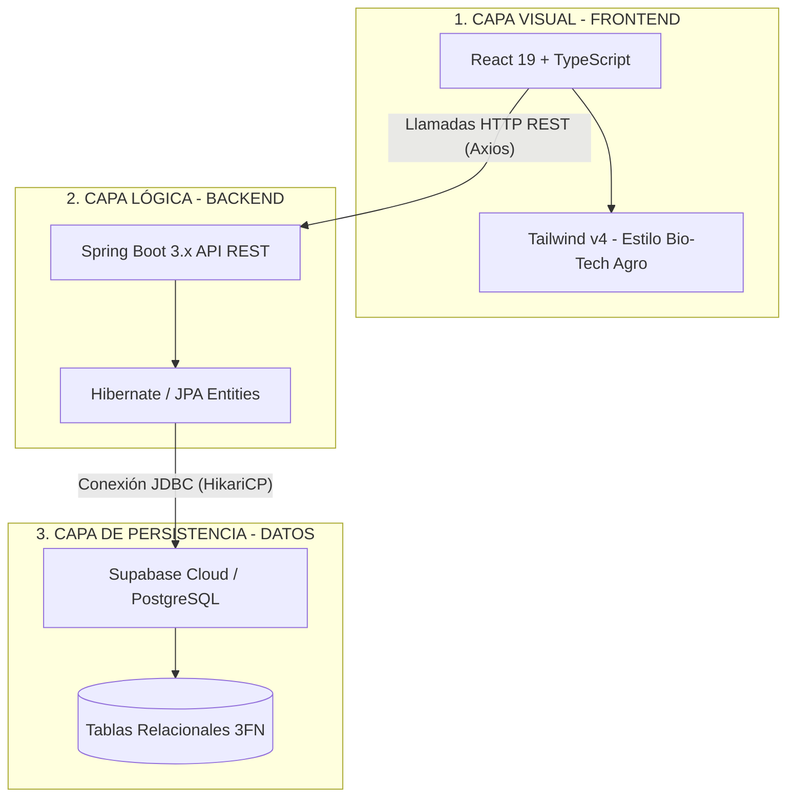

# MuyuAgro — Sistema de Trámite Documentario relacional
### *Proyecto Integrador de Base de Datos y Sistemas Relacionales — Universidad Nacional Agraria La Molina (UNALM)*

Este proyecto consiste en un **Sistema de Trámite Documentario** relacional y transaccional diseñado a la medida de una Mype agroexportadora peruana (**MuyuAgro S.A.C.**). Permite registrar, derivar, auditar y resolver expedientes documentarios (como certificados fitosanitarios de SENASA, packing lists, facturas comerciales, etc.), asegurando un control estricto del flujo de procesos y una trazabilidad 100% auditable.

El sistema cuenta con una arquitectura limpia de **tres capas**, un diseño de base de datos normalizado en **Tercera Forma Normal (3FN)** y una interfaz web premium con estética **Bio-Tech Agro** que conecta de forma nativa a la nube de **Supabase / PostgreSQL**.

---

## 🛠️ 1. Arquitectura del Sistema (3 Capas)

El proyecto está diseñado bajo un desacoplamiento estricto para garantizar mantenibilidad, escalabilidad y facilidad de sustentación académica:



1.  **Capa de Persistencia (Datos):** Una base de datos relacional robusta en **PostgreSQL** alojada en la nube de **Supabase**, con integridad referencial completa y restricciones de dominio.
2.  **Capa Lógica (Backend):** Un servicio RESTful desarrollado en **Java (Spring Boot)** con **Spring Data JPA** y **Hibernate** que implementa la lógica transaccional y expone endpoints JSON con control global de CORS.
3.  **Capa Visual (Frontend):** Una aplicación interactiva tipo Single Page Application (SPA) construida en **React 19**, **TypeScript** y **Tailwind CSS v4** con iconos vectoriales de **Lucide React** y una experiencia de usuario premium adaptada a la temática agroindustrial.

---

## 📁 2. Estructura de Carpetas (Cero Ruido)

El repositorio se mantiene con una organización impecable y libre de archivos innecesarios para facilitar la explicación individual ante el jurado calificador:

```text
Proyecto_Tramite_Documentario/
├── database/               # CAPA DE PERSISTENCIA (Base de Datos)
│   ├── schema.sql          # DDL: Creación de tablas, claves primarias/foráneas y restricciones
│   └── data.sql            # DML: Semilla de datos, catálogos e inicialización de personal
├── backend/                # CAPA LÓGICA (Servidor Spring Boot)
│   ├── src/main/java/com/tramite/backend/
│   │   ├── controller/     # Controladores REST que exponen las APIs públicas
│   │   ├── entity/         # Modelos de entidades JPA mapeados a las tablas SQL
│   │   ├── repository/     # Repositorios Spring Data para consultas relacionales a BD
│   │   ├── service/        # Servicios de lógica de negocio y transaccionalidad
│   │   └── BackendApplication.java # Punto de entrada principal del backend
│   ├── pom.xml             # Gestión de dependencias de Maven
│   └── src/main/resources/application.yml # Configuración relacional y puertos
├── frontend/               # CAPA VISUAL (Cliente React)
│   ├── src/
│   │   ├── components/     # Layout general y barra lateral de navegación dinámica
│   │   ├── pages/          # Pantallas de la app: Login, Bandeja, Registro, Seguimiento, etc.
│   │   ├── services/       # Clientes HTTP (Axios) para consumo de endpoints del backend
│   │   ├── types/          # Definiciones y firmas de tipos TypeScript
│   │   ├── index.css       # Configuración e importación de Tailwind v4
│   │   └── main.tsx        # Renderizado raíz de la aplicación
│   ├── index.html          # HTML5 contenedor principal
│   ├── package.json        # Gestión de dependencias de Node.js
│   └── vite.config.ts      # Configuración del empaquetador Vite
└── README.md               # Guía maestra de ejecución (este archivo)
```

---

## ☁️ 3. Conexión Directa a la Nube de Supabase

El sistema está listo para operar conectado a una instancia de base de datos PostgreSQL en la nube de **Supabase**. Sigue estos pasos para realizar la configuración en 5 minutos:

### Paso A: Preparar la Base de Datos en Supabase
1.  Inicia sesión o regístrate en [Supabase](https://supabase.com/).
2.  Crea un nuevo proyecto con el nombre `MuyuAgro-DB` y define una contraseña segura para la base de datos.
3.  Una vez creado el proyecto, ve al menú lateral izquierdo y selecciona **SQL Editor**.
4.  Haz clic en **New Query**, copia el contenido del archivo `database/schema.sql` y presiona **Run**. Esto creará todas las tablas relacionales y restricciones en la nube.
5.  Abre un nuevo query, copia el contenido de `database/data.sql` y presiona **Run**. Esto poblará el sistema con catálogos, remitentes (SENASA, MIDAGRI, etc.) y la plantilla de trabajadores.

### Paso B: Configurar la Conexión en Spring Boot
El archivo `backend/src/main/resources/application.yml` está diseñado para leer las credenciales desde variables de entorno o usar valores locales por defecto. 

Para conectar Supabase, tienes dos opciones:
1.  **Variables de Entorno (Recomendado):** Configura en tu sistema o IDE las siguientes variables:
    *   `DB_HOST`: El host de tu base de datos de Supabase (ej: `aws-0-us-west-1.pooler.supabase.com`).
    *   `DB_PORT`: `5432` o el puerto de conexión.
    *   `DB_NAME`: `postgres`.
    *   `DB_USER`: `postgres.tu_id_de_proyecto`.
    *   `DB_PASSWORD`: La contraseña de base de datos que definiste al crear el proyecto.
2.  **Modificación Directa (Rápida):** Puedes editar directamente el bloque `datasource` en `application.yml`:
    ```yaml
    spring:
      datasource:
        url: jdbc:postgresql://[HOST-DE-SUPABASE]:5432/postgres
        username: postgres.[ID-DE-PROYECTO]
        password: [TU-CONTRASEÑA]
    ```

---

## 🚀 4. Guía de Ejecución Local

### Requisitos Previos
*   **Java:** JDK 17 o superior.
*   **Maven:** Versión 3.9.x o superior.
*   **Node.js:** Versión 20.x o superior.
*   **npm:** Versión 10.x o superior.

---

### Ejecutar el Backend (Spring Boot)
1.  Abre una terminal y dirígete a la carpeta del backend:
    ```bash
    cd backend
    ```
2.  Compila el proyecto para descargar las dependencias y verificar la ausencia de errores:
    ```bash
    mvn clean compile
    ```
3.  Arranca el servidor en el puerto `8080`:
    ```bash
    mvn spring-boot:run
    ```
    *Hibernate validará automáticamente la base de datos contra los modelos Java gracias a la directiva `ddl-auto: validate`.*

---

### Ejecutar el Frontend (React)
1.  Abre una nueva terminal y dirígete a la carpeta del frontend:
    ```bash
    cd frontend
    ```
2.  Instala las dependencias necesarias de Node.js:
    ```bash
    npm install
    ```
3.  Inicia el servidor de desarrollo local de Vite:
    ```bash
    npm run dev
    ```
4.  Abre en tu navegador la dirección indicada en la terminal (usualmente `http://localhost:5173` o `http://localhost:5175`).

---

## 👥 5. Características Destacadas y Flujo Académico

El sistema está optimizado para destacar visual y funcionalmente en una evaluación universitaria:

### A. Estética Premium "Bio-Tech Agro"
El sistema de diseño implementado en Tailwind CSS v4 utiliza una paleta cromática sofisticada adaptada al sector agroexportador de alta tecnología:
*   **Azul Marino Profundo (`#0B192C`):** Estructura del menú lateral y cabecera que aporta rigor y elegancia corporativa.
*   **Teal/Cian Vibrante (`#00BDB0`):** Detalles táctiles, enlaces activos e iconos de destaque tecnológico.
*   **Verde Agrícola (`#74C365`):** Distintivos de estados resueltos, respuestas conformes y éxitos de flujo.
*   **Naranja Tecnológico (`#FF9F0D`):** Alertas de atención de documentos pendientes o urgentes.

### B. Inicio de Sesión Multiusuario Dinámico
El sistema **no simula una sesión fija**. Al cargar la pantalla de inicio de sesión:
1.  El frontend consulta de forma reactiva al backend la lista de empleados reales registrados en la base de datos (`GET /api/empleados`).
2.  Si el backend está desconectado, el sistema cambia automáticamente al **Modo de Simulación Académica Local** cargando una plantilla predefinida idéntica a la semilla SQL para que la aplicación nunca deje de funcionar.
3.  El usuario selecciona el perfil con el que desea interactuar (ej. *Ana García - Secretaria de Mesa de Partes*, *Carlos Ramírez - Gerente General*, etc.).
4.  Toda la aplicación se contextualiza bajo su cargo y área de trabajo. Al registrar documentos, derivar expedientes o redactar respuestas oficiales, el emisor o autor se **bloquea y asocia automáticamente con su ID en base de datos**, garantizando la trazabilidad real.

### C. Normalización Relacional 3FN Completa
El modelo relacional (`database/schema.sql`) cumple estrictamente con las reglas de normalización para evitar redundancias y anomalías de inserción/borrado:
*   **Primera Forma Normal (1FN):** Todos los atributos son atómicos; no hay grupos repetidos. Las palabras clave del documento se extraen a una tabla de ruptura intermedia (`documento_palabra_clave`).
*   **Segunda Forma Normal (2FN):** Cumple con 1FN y todos los atributos que no forman parte de la clave primaria dependen funcionalmente de manera completa de ella.
*   **Tercera Forma Normal (3FN):** Cumple con 2FN y no existen dependencias transitivas. Por ejemplo, los atributos del empleado dependientes de su área y cargo se extraen a las tablas independientes `area` y `cargo` respectivamente, referenciadas por claves foráneas.

---

## 🎓 6. Diccionario de Datos Breve

*   `area`: Áreas u oficinas de la organización (ej: Mesa de Partes, Gerencia, Logística).
*   `cargo`: Cargos del personal (ej: Secretario, Gerente, Especialista).
*   `empleado`: Personal de MuyuAgro con credenciales asociadas a un área y cargo.
*   `remitente`: Entidades externas emisoras de documentos (ej: SENASA, MIDAGRI).
*   `tipo_documento`: Catálogo de tipos de documento (ej: Oficio, Packing List).
*   `estado_documento`: Estados del trámite (Pendiente, Derivado, Respondido, Archivado).
*   `documento`: Cabecera del expediente con correlativo autogenerado, remitente, tipo e importancia.
*   `derivacion`: Movimientos históricos del expediente entre empleados (emisor y receptor) con proveídos de despacho y marcas temporales automáticas.
*   `tipo_respuesta`: Clasificaciones de fallo o solución (ej: Aprobación, Observación).
*   `respuesta`: Resolución final del trámite documentario que vincula al autor, fecha y descripción técnica del descargo.
