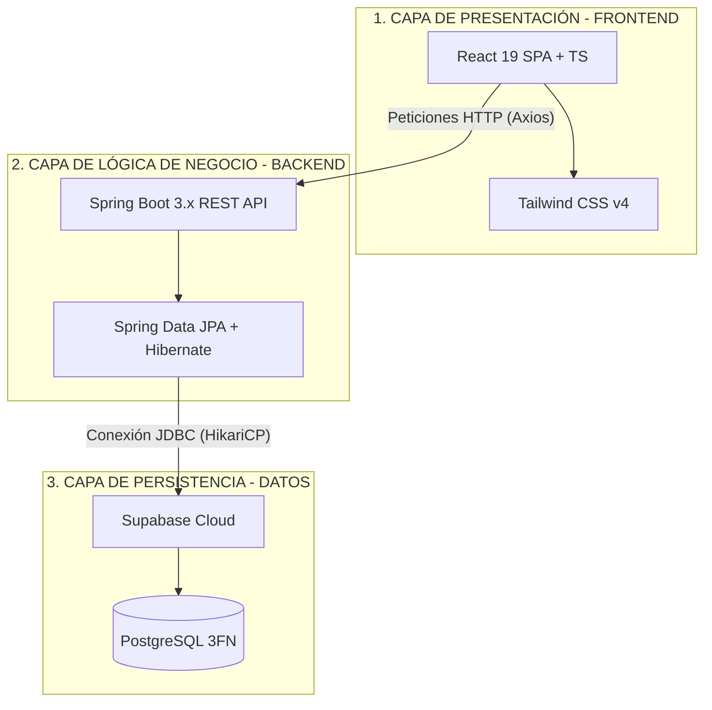
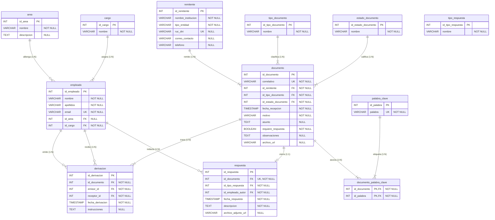
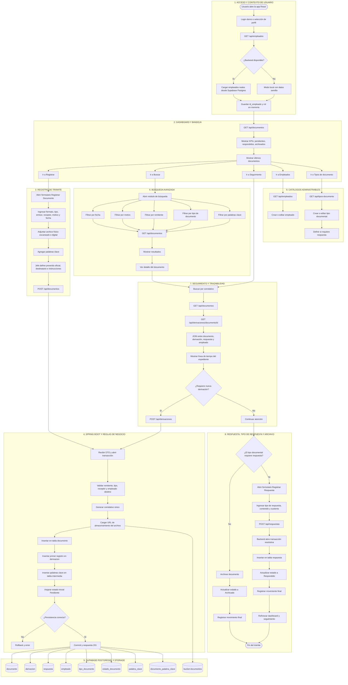

# 🏛️ Proyecto Integrador: Sistema de Gestión de Trámite Documentario para Mypes Agroexportadoras ("MuyuAgro")
### **Universidad Nacional Agraria La Molina (UNALM)**  
*Facultad de Economía y Planificación — Departamento Académico de Estadística e Informática*  
**Curso:** Sistemas de Gestión de Base de Datos I (Ciclo V — Semestre 2026-I)  
**Docentes:** MSc. Ivan Soto Rodriguez / MSc. Beatriz Montaño  

---

## 👥 1. Portafolio Académico del Grupo de Investigación (Grupo 04)

El proyecto ha sido desarrollado bajo una **metodología de participación cooperativa del 100%**, donde cada integrante lideró un componente crítico del sistema de acuerdo a las competencias del sílabo:

| Integrante | Rol Principal | Tarea Específica | Contribución Clave |
| :--- | :--- | :--- | :--- |
| **Gabriel** | Líder de Procesos | Tarea 1: Bizagi | Modelado del flujo de datos inicial en BPMN (Bizagi), mapeo de carriles (Lanes) y análisis del ciclo de vida del documento. |
| **Jeremi** | Líder de Estructura | Tarea 2: Diccionario | Diseño técnico del Diccionario de Datos, definición de dominios, tipos de datos PostgreSQL y restricciones de integridad. |
| **Dana** | Líder de Modelado | Tarea 3: MER | Elaboración conceptual y diagramación del Modelo Entidad-Relación (MER), definición de relaciones y cardinalidades. |
| **Megumi** | Líder de Base de Datos | Tarea 4: SQL y Normalización | Redacción del Script SQL (DDL/DML) y normalización científica de la base de datos a la Tercera Forma Normal (3FN) y Boyce-Codd. |
| **Dayvi** | Líder de Frontend | Tarea 5: Interfaz (UX) | Desarrollo de la interfaz gráfica SPA en React 19, TypeScript y sistema visual minimalista con la paleta de la marca. |
| **Bryan** | Líder de Arquitectura | Tarea 6: Backend y Conexión | Desarrollo de las APIs REST en Spring Boot 3.x, persistencia JPA con Hibernate, transacciones atómicas y conectividad a Supabase. |

---

## 🏗️ 2. Arquitectura de Software Desacoplada (3 Capas)

El sistema implementa una arquitectura desacoplada y robusta que separa de manera estricta la presentación, la lógica y los datos:



---

## 📊 3. Modelo de Datos Físico (DER)

A continuación se presenta el **Diagrama Entidad-Relación Físico (DER)** de la base de datos en Supabase, modelado en la nube en **Tercera Forma Normal (3NF)**:



### 🖼️ Visualización del Esquema Relacional (Supabase Cloud)

Para mayor detalle de las restricciones físicas de la base de datos de producción, se anexa la captura del visualizador de esquemas de Supabase:


> [!TIP]
> **Instrucción para el Alumno:** Toma captura a la pantalla del visualizador de esquemas de Supabase y guárdala exactamente con el nombre `schema_visualizer.png` dentro de la carpeta `database/` del proyecto para que la imagen se renderice automáticamente en esta sección del README en GitHub.

---

## 📈 4. Mapa Completo del Flujo Transaccional (9 Subprocesos)

El siguiente diagrama de flujo modela de forma exhaustiva el comportamiento transaccional del sistema, mapeando las interacciones del frontend, las peticiones HTTP REST, la lógica del backend en Spring Boot y la persistencia atómica en PostgreSQL:



---

## 💎 5. Valor Agregado Académico y Creatividad

1. **Trazabilidad Absoluta en Tiempo Real:** El sistema permite rastrear la cadena de custodia del documento, mostrando un *timeline* interactivo que indica qué funcionario lo tiene, cuándo lo recibió y qué instrucciones de proveído redactó.
2. **Inicio de Sesión Multiusuario Dinámico:** El sistema no simula una sesión estática. Carga los perfiles reales desde Supabase y adapta el menú y las firmas de los proveídos automáticamente con el ID del empleado registrado en base de datos.
3. **Resiliencia Local (Offline Graceful Fallback):** Si la base de datos en la nube está desconectada, la app React detecta el estado y activa de inmediato un simulador local alimentado por los datos semilla del script `data.sql`, garantizando que la demostración en vivo nunca falle.

---

## 🚀 6. Guía Máster de Instalación y Despliegue

### Requisitos Previos
*   **Java Development Kit (JDK):** Versión 17 o superior.
*   **Apache Maven:** Versión 3.9.x o superior.
*   **Node.js:** Versión 20.x o superior.
*   **Base de Datos:** Cuenta activa en [Supabase](https://supabase.com/).

### Paso 1: Configurar Base de Datos en Supabase
1. Crea un nuevo proyecto en Supabase llamado `MuyuAgro-DB`.
2. Ve a la sección **SQL Editor** en el menú lateral.
3. Crea un **New Query**, pega el contenido de [schema.sql](file:///c:/Users/bryan/Muyu360_BD/Proyecto_Tramite_Documentario/database/schema.sql) y presiona **Run**.
4. Crea otro Query, pega el contenido de [data.sql](file:///c:/Users/bryan/Muyu360_BD/Proyecto_Tramite_Documentario/database/data.sql) y presiona **Run** para cargar el personal y catálogos semilla.

### Paso 2: Ejecutar el Servidor Backend (Spring Boot)
1. Dirígete a la carpeta del backend en la terminal:
   ```bash
   cd backend
   ```
2. Configura las credenciales en el archivo `src/main/resources/application.yml` colocando el Host, Puerto y la contraseña de Supabase, o a través de variables de entorno.
3. Compila y ejecuta el servidor:
   ```bash
   mvn clean compile
   mvn spring-boot:run
   ```
   *El servidor iniciará en el puerto `8080` de manera local.*

### Paso 3: Ejecutar el Cliente Frontend (React 19)
1. Abre una nueva terminal y dirígete a la carpeta del frontend:
   ```bash
   cd frontend
   ```
2. Instala las dependencias y arranca el servidor de desarrollo:
   ```bash
   npm install
   npm run dev
   ```
3. Accede a la URL indicada (usualmente `http://localhost:5173` o `http://localhost:5175`).

---

**Lima, 2026**  
**Universidad Nacional Agraria La Molina**  
*Dpto. de Estadística e Informática*  
*Proyecto con fines de investigación académica*  
