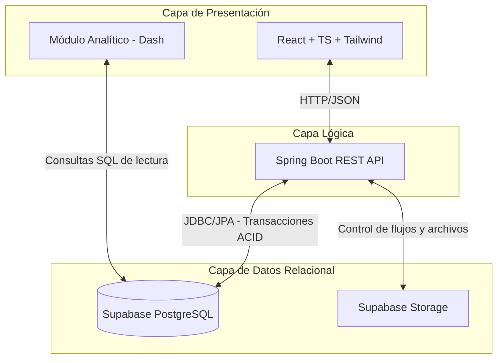
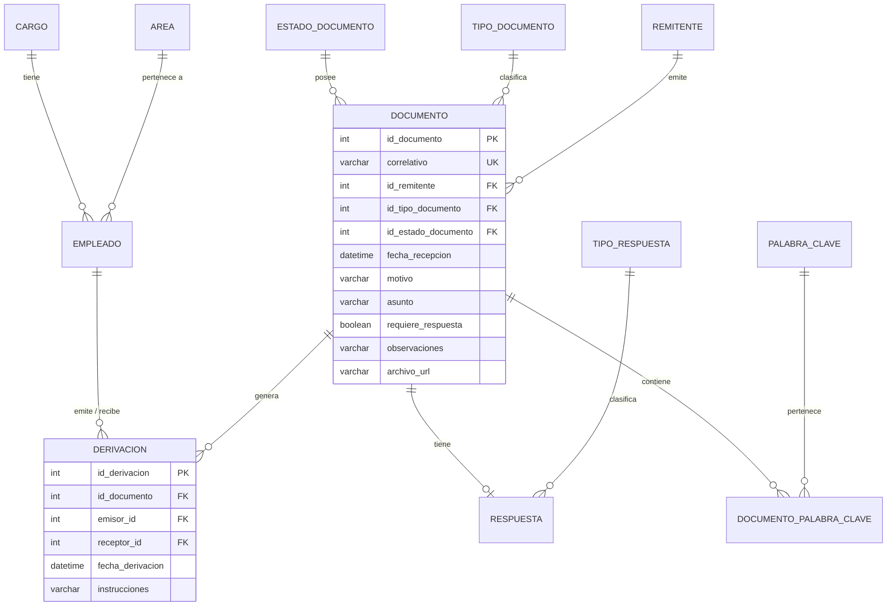

# Blueprint Completo: Proyecto Final de Sistemas de Gestión de Base de Datos (UNALM) - Versión 2

Este documento es la guía definitiva y el blueprint arquitectónico para la construcción y sustentación del proyecto final del curso, adaptando el caso de "Trámite Documentario" a una Mype agroexportadora, cumpliendo con todos los requisitos académicos y técnicos exigidos.

---

## 1. Resumen del proyecto
El presente proyecto consiste en el análisis, diseño e implementación de un **software de gestión documental** basado en una **arquitectura web en capas** y centralizado en una **solución basada en base de datos relacional (PostgreSQL)**. Está orientado a resolver los cuellos de botella en la gestión documental de una Mype agroexportadora, donde la pérdida de trazabilidad de documentos (certificados fitosanitarios, resoluciones, requerimientos) genera retrasos operativos. El núcleo del sistema abarca el registro, escaneo, derivación (proveído), seguimiento, respuesta y archivo de documentos, complementado de forma secundaria con un módulo analítico para la supervisión de la carga laboral.

---

## 2. Título final sugerido
**"Diseño e Implementación de un Sistema Relacional de Trámite Documentario para la Gestión Administrativa de una Mype Agroexportadora"**
*(Este título es directo, académico y refleja fielmente el núcleo del caso base solicitado por el curso).*

---

## 3. Antecedentes
A nivel de estado del arte, muchas organizaciones aún mantienen el control documental en hojas de cálculo, cuadernos de partes físicos o canales digitales dispersos (correos, WhatsApp). Esto limita severamente la trazabilidad, el control centralizado y el cumplimiento de los tiempos de respuesta. En el caso específico de las Mypes agroexportadoras, a raíz de la pandemia y el crecimiento del trabajo híbrido, han experimentado una transición desordenada hacia la digitalización. Esta dualidad físico-virtual ha provocado que no exista un correlativo único, generando pérdida de documentos críticos, traspapelamiento de resoluciones y una falta de visibilidad sobre los responsables de cada trámite.

---

## 4. Problema (Planteamiento)
**Problema Principal:** ¿De qué manera la falta de un sistema centralizado y relacional afecta la trazabilidad, los tiempos de respuesta y la eficiencia en la gestión de trámites documentarios de una Mype agroexportadora?
**Síntomas:** 
- Trámites no respondidos o respondidos fuera de plazo.
- Imposibilidad de auditar de forma fiable el "proveído" (quién derivó qué, a quién y cuándo).
- Dificultad para encontrar documentos históricos ante auditorías o inspecciones.
- Malestar en clientes y proveedores, y potencial pérdida de presupuestos/contratos.

---

## 5. Objetivos
**Objetivo General:**
Diseñar e implementar un sistema de información basado en una base de datos relacional para optimizar el registro, la derivación, el seguimiento y la respuesta del trámite documentario en una Mype agroexportadora.

**Objetivos Específicos:**
1. Elaborar el modelo de datos Entidad-Relación y el diseño lógico-físico aplicando reglas de normalización hasta la 3FN para asegurar la integridad transaccional.
2. Modelar los procesos de negocio (AS-IS y TO-BE) del flujo documentario utilizando notación BPMN estándar en Bizagi.
3. Desarrollar una API REST en Java con Spring Boot que centralice las reglas de negocio y actúe como capa lógica del sistema.
4. Construir una interfaz de usuario en React para facilitar el registro, búsqueda y gestión de los documentos.
5. Desarrollar un módulo analítico complementario (Dash/Python) para visualizar métricas clave.

---

## 6. Justificación e Impacto
- **Justificación Académica:** Demuestra el dominio práctico del modelado de datos, la normalización, la implementación de restricciones de integridad (PKs, FKs) y la escritura de consultas SQL complejas, situando a la base de datos como el corazón de una arquitectura de software.
- **Justificación Técnica:** La elección de **Supabase (PostgreSQL)** como motor relacional en la nube asegura soporte ACID puro. **Spring Boot** orquesta la lógica transaccional, mientras que **React** brinda usabilidad.
- **Justificación Funcional:** Se elimina la dispersión de documentos mediante un registro centralizado con correlativos únicos y catálogos estandarizados.
- **Justificación Social/Organizacional:** Optimiza el tiempo del personal administrativo, previene la pérdida de documentos vitales para la exportación y mejora la transparencia organizacional.

---

## 7. Arquitectura tecnológica



**Flujo de Archivos:** Para garantizar la seguridad y control, el frontend se comunica exclusivamente con Spring Boot. El backend valida los metadatos y coordina la subida del archivo (PDF) a Supabase Storage mediante un flujo controlado.

---

## 8. Módulos del sistema
1. **Mesa de Partes (Recepción):** Ingreso de documentos físicos y virtuales. Generación de índice correlativo automático.
2. **Derivación (Proveído):** Asignación de documentos (con instrucciones) a los trabajadores. Bandeja de entrada personalizada.
3. **Gestión y Respuesta:** Registro de respuestas a documentos, asociadas a su tipo.
4. **Búsqueda Avanzada:** Motor de búsqueda por fecha, motivo, remitente, palabras clave y tipo.
5. **Dashboard Analítico (Complementario):** Panel extra, no transaccional, para mostrar carga laboral y tiempos.

---

## 9. Fases del plan de trabajo
1. **Fase 1: Análisis y Modelado (Semanas 1-2):** Levantamiento de requerimientos, diagramación en Bizagi.
2. **Fase 2: Diseño de Base de Datos (Semanas 3-4):** Modelo E-R, normalización, **diccionario de datos, reglas de negocio y scripts de consultas base SQL**.
3. **Fase 3: Desarrollo Backend (Semanas 5-7):** Configuración de Spring Boot, DTOs, repositorios, controladores, conexión a PostgreSQL.
4. **Fase 4: Desarrollo Frontend (Semanas 8-10):** Vistas en React, gestión de catálogos y consumo de API.
5. **Fase 5: Módulo Analítico (Semana 11):** Script de Dash consumiendo vistas de BD.
6. **Fase 6: Pruebas (Semana 12-13):** Inserción de datos de prueba, validaciones funcionales.
7. **Fase 7: Sustentación (Semana 14):** Armado de PPT, preparación de guion y demo.

---

## 10. Bizagi: Qué y cómo modelar
El modelo BPMN debe reflejar el flujo transaccional.
- **Elementos requeridos:**
  - Evento de inicio por mensaje (llegada del documento del Remitente).
  - Eventos de fin bien definidos (Documento Archivado o Respuesta Enviada).
  - Objetos de datos (Data Objects) conectados a las tareas para representar el documento físico/digital transitando.
- **Lanes:**
  1. *Remitente* (Externa).
  2. *Mesa de Partes* (Registra).
  3. *Jefatura* (Deriva/Provee).
  4. *Trabajador Asignado* (Responde).

---

## 11. Modelo Entidad-Relación (MER)

**Entidades Principales Recomendadas (Núcleo Relacional):**
- `remitente` (o institucion_remitente)
- `empleado`
- `cargo` (catálogo)
- `area` (opcional: justificada como apoyo para organizar a los empleados)
- `tipo_documento` (catálogo)
- `estado_documento` (catálogo)
- `documento` (entidad central)
- `derivacion` (actúa también como historial de movimientos)
- `respuesta`
- `tipo_respuesta` (catálogo)
- `palabra_clave`
- `documento_palabra_clave` (tabla intermedia)

*Opcionales (si hay tiempo): `historial_movimiento` (si se desea un log separado de las derivaciones), `alerta`, `cliente`, `lote_exportacion`.*

---

## 12. Diseño Relacional (Esquema de Tablas)

A continuación, un diagrama que ilustra cómo se interconectan los catálogos y las entidades principales:


*(Nota: El campo estado no es un VARCHAR libre, sino una clave foránea que apunta al catálogo `estado_documento`, garantizando integridad referencial).*

---

## 13. Diccionario de Datos (Muestra)

| Tabla | Campo | Tipo de Dato | PK/FK | Nulabilidad | Descripción |
|-------|-------|--------------|-------|-------------|-------------|
| **documento** | id_documento | INT | PK | NOT NULL | ID autonumérico |
| | correlativo | VARCHAR(30) | - | NOT NULL | UNIQUE. Ej: DOC-2026-001 |
| | id_estado_documento| INT | FK | NOT NULL | Ref: estado_documento (Pendiente, etc) |
| | requiere_respuesta | BOOLEAN | - | NOT NULL | Flag para saber si se archiva directo |
| **derivacion**| emisor_id | INT | FK | NOT NULL | Ref: empleado (Jefe que deriva) |
| | receptor_id | INT | FK | NOT NULL | Ref: empleado (Asignado) |
| | fecha_derivacion| TIMESTAMP| - | NOT NULL | Cuándo se hizo el proveído |
| **respuesta** | id_tipo_respuesta| INT | FK | NOT NULL | Ref: tipo_respuesta |

---

## 14. Reglas de Negocio
- **R1:** Todo documento ingresado debe generar un índice correlativo único en la base de datos.
- **R2:** Toda derivación (proveído) debe registrar obligatoriamente la fecha, el emisor y el receptor.
- **R3:** No puede existir un registro en la tabla `respuesta` para un `documento` inexistente.
- **R4:** Un documento categorizado con `requiere_respuesta = FALSE` puede pasar directamente al estado "Archivado".

---

## 15. Backend (Java Spring Boot)
- **Estructura en Capas:** Entidades JPA, Repositorios, Servicios (con `@Transactional`), Controladores REST.
- **Mejoras críticas:**
  - Uso de **DTOs** (Data Transfer Objects) para las entradas y salidas de la API.
  - **Manejo Global de Excepciones** (`@ControllerAdvice`) para capturar errores de base de datos y devolver JSON limpios con `400 Bad Request`.
  - **Filtros dinámicos** usando JPA Specifications/CriteriaBuilder para la búsqueda multicriterio.
  - **Paginación** (`Pageable`) en los endpoints de listados.

---

## 16. Frontend (React + TypeScript + Tailwind)
- **Pantallas clave a implementar:**
  - `Layout`: Navegación lateral.
  - `FormularioRegistro`: Para registrar documentos nuevos.
  - `BandejaEntrada`: Tabla con paginación para las derivaciones asignadas.
  - `DetalleDocumento`: Vista individual que muestra los datos del doc y su **historial de derivaciones**.
  - `BusquedaAvanzada`: Grilla con filtros.
  - `GestionCatalogos`: CRUD simple para gestionar cargos, tipos, áreas, etc.

---

## 17. Dashboard Analítico (Complementario)
- **Concepto:** Es un "módulo analítico complementario" y **no forma parte del núcleo transaccional**. Su fin es sumar puntos por creatividad y explotar la estructura relacional.
- **Tecnología:** Script en Dash/Python que hace consultas de *solo lectura* a PostgreSQL.
- **Gráficos sugeridos:** Documentos ingresados por mes (líneas), proporción de documentos pendientes vs. respondidos (torta).

---

## 18. Base de Datos y SQL (Scripts Clave)
Debe prepararse un `schema.sql` (para crear el modelo) y `data.sql` (para poblar catálogos).
*Consulta para búsqueda avanzada (ejemplo para la sustentación):*
```sql
SELECT d.correlativo, t.nombre as tipo, e.nombre as estado
FROM documento d
JOIN tipo_documento t ON d.id_tipo_documento = t.id_tipo
JOIN estado_documento e ON d.id_estado_documento = e.id_estado
JOIN documento_palabra_clave dpc ON d.id_documento = dpc.id_documento
JOIN palabra_clave p ON dpc.id_palabra = p.id_palabra
WHERE p.palabra = 'SENASA' AND d.fecha_recepcion >= '2026-01-01';
```

---

## 19. Datos de Prueba (Seeders)
Para que el sistema sea creíble en la demostración sin requerir una carga excesiva:
- **30–50 documentos** variados (físicos, virtuales, diversos tipos).
- **20–40 derivaciones** (algunos documentos con múltiples proveídos).
- **10–15 respuestas** completadas.
- **15–20 palabras clave** distribuidas.
- **Catálogos llenos:** Cargos, Áreas, Estados ("Pendiente", "Derivado", "En Proceso", "Respondido", "Archivado").

---

## 20. Casos de Uso y Pruebas
1. **Registrar documento:** Probar que el campo correlativo se autogenere y los catálogos se listen bien.
2. **Derivación:** El jefe deriva un documento, se guarda la FK y cambia el `estado_documento`.
3. **Respuesta:** Validar que no permita responder si el documento no lo requiere, o que cambie el estado al finalizar.
4. **Búsqueda multicriterio:** Filtrar simultáneamente por remitente, fecha y palabra clave.

---

## 21. Cronograma Sugerido (14 semanas)
*(Ver desglose en la Fase 9. Recomiendo ceñirse rígidamente a los plazos, especialmente cerrando el MER en la semana 4).*

---

## 22. Distribución del Equipo (4-5 Integrantes)
- **Rol 1 (PM & BD):** Diseña E-R, normaliza, crea el script SQL, datos de prueba.
- **Rol 2 (Backend Java):** Crea APIs, DTOs y lógica transaccional.
- **Rol 3 (Frontend React):** Interfaces, manejo de estados, llamadas a API.
- **Rol 4 (Análisis & Bizagi):** Modela procesos, casos de prueba, y redacta la documentación formal.
*(El Dashboard Dash puede ser asumido por el Rol 1 o Rol 4).*

---

## 23. Guion de Exposición (Pitch de 10 min)
- **Min 0-2 (Planteamiento):** "El estado del arte nos indica que las mypes llevan su gestión documental en cuadernos... esto genera caos. Nuestro sistema lo soluciona de raíz".
- **Min 2-4 (Núcleo Relacional):** "Hemos diseñado un modelo normalizado a 3FN. Los estados y tipos son catálogos (claves foráneas) para asegurar consistencia, y la tabla derivación permite un historial auditable".
- **Min 4-7 (Demo):** Mostrar el ciclo: Subir Documento -> Derivar -> Responder -> Buscar.
- **Min 7-8 (Código Backend):** Mostrar rápidamente un método transaccional o el manejo global de excepciones.
- **Min 8-10 (Dashboard & Cierre):** "Finalmente, como valor agregado, usamos vistas SQL para nuestro módulo analítico complementario".

---

## 24. Entregables Finales
- Informe Académico (con diccionario, reglas, SQL).
- Archivo Bizagi (.bpm).
- Scripts `schema.sql` y `data.sql`.
- Repositorios de Código (Java, React, Python).
- PPT de sustentación.

---

## 25. Riesgos y Mitigaciones
- **Pérdida de Integridad:** Resuelto mediante restricciones estandarizadas (FK, UNIQUE) desde PostgreSQL.
- **CORS:** Configuración temprana en Spring Boot para permitir solicitudes desde React.

---

## 26. Recomendaciones Finales
- **La Base de Datos es la Reina:** Todas las decisiones deben justificarse para mantener la integridad de los datos.
- **Usen Nombres Claros:** `estado_documento` en BD, `EstadoDocumento` en Java Entity, `estadoDocumento` en JSON.
- **Prepárense para preguntas sobre la N:M:** Los docentes siempre preguntan cómo se resolvió la relación de muchos a muchos. Tengan lista la explicación de la tabla `documento_palabra_clave`.
